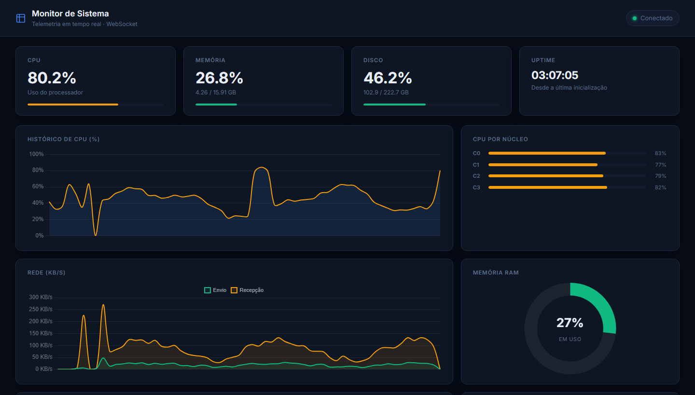

# Real-Time System Monitor Dashboard

<div align="center">

[](https://python.org)
[](https://flask.palletsprojects.com)
[](https://socket.io)
[](https://sqlite.org)
[](LICENSE)

**A production-ready system monitoring dashboard with real-time WebSocket telemetry, reactive charts, historical persistence, and threshold alerting — built with Python (Flask) and Vanilla JS.**

</div>

---



---

## Features

- **Real-time telemetry** — metrics pushed every second via WebSocket (Socket.IO), with sub-second latency
- **Per-core CPU breakdown** — individual utilization bar for each logical core
- **Network I/O rates** — live send/receive KB/s calculated as delta between readings
- **Disk I/O rates** — read/write throughput in KB/s using incremental counters
- **Top processes** — top 6 processes ranked by CPU consumption, updated live
- **Historical pre-load** — on page load, the last 5 minutes of data are fetched from SQLite and pre-populate the charts
- **Threshold alerting** — cards pulse red and an alert bar appears when CPU ≥ 85%, RAM ≥ 85%, or Disk ≥ 90%
- **Offline detection** — banner appears after 10 s of disconnection; automatic reconnection with exponential backoff (1 s → 30 s)
- **24-hour retention** — metrics are persisted to SQLite every 5 seconds and automatically purged after 24 hours

---

## Tech Stack

| Layer | Technology | Rationale |
|---|---|---|
| Backend | Python 3.10 + Flask 3 | Lightweight, expressive routing |
| Real-time | Flask-SocketIO + Socket.IO | Full-duplex WebSocket with graceful fallback |
| Data collection | psutil | Cross-platform hardware metrics |
| Persistence | SQLite (WAL mode) | Zero-dependency storage; WAL enables concurrent reads without blocking writes |
| Frontend | Vanilla JS (ES2020) | No framework overhead; full control over the update loop |
| Charts | Chart.js 4 | Lightweight canvas-based rendering (~60 KB gzip) |
| Styling | CSS Grid + Custom Properties | Responsive layout without a CSS framework |

---

## Architecture

```
┌─────────────────────────────────────────────────────────┐
│                        Browser                          │
│  dashboard.js                                           │
│  ┌──────────────┐  WebSocket   ┌──────────────────────┐ │
│  │  Socket.IO   │◄────────────►│   Flask-SocketIO     │ │
│  │   Client     │              │   (threading mode)   │ │
│  └──────┬───────┘              └──────────┬───────────┘ │
│         │ metrics event                   │             │
│  ┌──────▼───────────────────┐    ┌────────▼──────────┐  │
│  │  Chart.js  │  KPI Cards  │    │  broadcast_loop   │  │
│  │  (4 charts)│  Alert Bar  │    │  (daemon thread)  │  │
│  └─────────────────────────┘    └────────┬──────────┘  │
└─────────────────────────────────────────│───────────────┘
                                          │
                          ┌───────────────▼───────────────┐
                          │         telemetry.py           │
                          │  MetricsCollector (thread-safe)│
                          │  ┌──────────┐ ┌─────────────┐ │
                          │  │  psutil  │ │  threading  │ │
                          │  │ (hw read)│ │    Lock     │ │
                          │  └──────────┘ └─────────────┘ │
                          └───────────────┬───────────────┘
                                          │ every 5s
                          ┌───────────────▼───────────────┐
                          │         database.py            │
                          │      SQLite + WAL mode         │
                          │  save_metric() / get_history() │
                          └───────────────────────────────┘
```

### Design Decisions

- **`MetricsCollector` class with `threading.Lock`** — network and disk counters are incremental (delta/dt). Without a lock, concurrent reads from the broadcast thread and the `on_connect` handler would corrupt those deltas.

- **`emit()` vs `socketio.emit()` in `on_connect`** — Flask-SocketIO's `emit()` sends only to the connecting client. `socketio.emit()` would broadcast to all connected clients on every new connection.

- **SQLite WAL mode** — the broadcast thread writes every 5 s while the HTTP `/api/history` endpoint reads concurrently. WAL prevents write locks from blocking read queries.

- **Rolling window of 60 points** — the client maintains a fixed-size buffer; no unbounded memory growth regardless of session duration.

---

## Project Structure

```
dashboard-interativo/
├── app.py              # Flask app, SocketIO config, HTTP routes, background thread
├── telemetry.py        # MetricsCollector — hardware data collection (psutil)
├── database.py         # SQLite persistence — save_metric, get_history, init_db
├── requirements.txt
├── .env.example        # Environment variable template
├── templates/
│   └── index.html      # Semantic HTML5, ARIA attributes, responsive grid
└── static/
    ├── css/
    │   └── dashboard.css   # CSS custom properties, Grid layout, dark theme
    └── js/
        └── dashboard.js    # Socket.IO client, Chart.js, alert system
```

---

## Quickstart

### Prerequisites

- Python 3.10 or higher
- pip

### Installation

```bash
# 1. Clone the repository
git clone https://github.com/your-username/dashboard-interativo.git
cd dashboard-interativo

# 2. Create and activate a virtual environment
python -m venv .venv
# Windows
.venv\Scripts\activate
# macOS / Linux
source .venv/bin/activate

# 3. Install dependencies
pip install -r requirements.txt

# 4. Configure environment variables
cp .env.example .env
# Edit .env and set a strong SECRET_KEY
```

### Running

```bash
python app.py
```

Open [http://localhost:5000](http://localhost:5000) in your browser.

---

## Configuration

| Variable | Default | Description |
|---|---|---|
| `SECRET_KEY` | `dev-insecure-change-in-prod` | Flask session signing key — **must be changed in production** |

Generate a secure key:
```bash
python -c "import secrets; print(secrets.token_hex(32))"
```

---

## API

| Endpoint | Method | Description |
|---|---|---|
| `/` | GET | Serves the dashboard HTML |
| `/api/history?minutes=N` | GET | Returns the last N minutes of metrics from SQLite (max 60) |

### Metrics payload (WebSocket `metrics` event)

```json
{
  "timestamp": 1716840000000,
  "cpu":     { "percent": 42.3, "cores": [38.0, 51.0, 44.0, 36.0] },
  "memory":  { "percent": 61.5, "used_gb": 9.8, "total_gb": 15.9 },
  "disk":    { "percent": 45.6, "used_gb": 101.5, "total_gb": 222.7 },
  "network": { "send_kbps": 12.4, "recv_kbps": 87.2 },
  "disk_io": { "read_kbps": 0.0, "write_kbps": 245.1 },
  "processes": [
    { "pid": 1234, "name": "chrome.exe", "cpu": 18.2, "mem": 3.1 }
  ],
  "uptime": "02:14:35"
}
```

---

## Production Notes

This project uses Flask's built-in development server (`allow_unsafe_werkzeug=True`), which is suitable for local use and portfolio demonstration. For a production deployment, replace it with:

```bash
pip install gevent gunicorn
gunicorn --worker-class gevent -w 1 "app:app"
```

> `gevent` is required because Socket.IO needs long-lived connections that are incompatible with multi-worker WSGI without a cooperative concurrency model.

---

## License

Distributed under the MIT License. See [LICENSE](LICENSE) for details.
